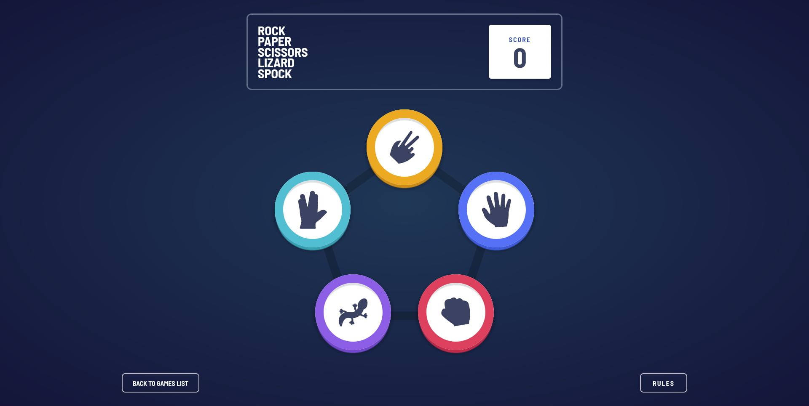

# Frontend Mentor - Rock, Paper, Scissors solution

This is a solution to the [Rock, Paper, Scissors challenge on Frontend Mentor](https://www.frontendmentor.io/challenges/rock-paper-scissors-game-pTgwgvgH). Frontend Mentor challenges help you improve your coding skills by building realistic projects.

## Table of contents

- [Overview](#overview)
  - [The challenge](#the-challenge)
  - [Screenshot](#screenshot)
  - [Links](#links)
- [My process](#my-process)
  - [Built with](#built-with)
  - [What I learned](#what-i-learned)
- [Author](#author)

## Overview

### The challenge

Users should be able to:

- View the optimal layout for the game depending on their device's screen size
- Play Rock, Paper, Scissors against the computer
- Maintain the state of the score after refreshing the browser _(optional)_
- **Bonus**: Play Rock, Paper, Scissors, Lizard, Spock against the computer _(optional)_

### Screenshot

### Links

- [Solution URL](https://github.com/Serj-L/Games-app)
- [Live Site URL](https://serj-l.github.io/Games-app)

## My process

### Built with

- Semantic HTML5 markup
- CSS modules
- CSS custom properties
- Grid
- Flexbox
- [React](https://reactjs.org/)
- [React Router v6](https://reactrouter.com/)
### What I learned

During developing this project I dive deeper into optimization in React and CSS Grid as well as CSS custom properties.
## Author

- Website - [Serj-L](https://serj-l.github.io/Profile)
- Frontend Mentor - [@Serj-L](https://www.frontendmentor.io/profile/yourusername)
- LinkedIn - [Sergei Lepnyakov](https://www.linkedin.com/in/serj-l)

## License

MIT

**✨ Free Software ✨**